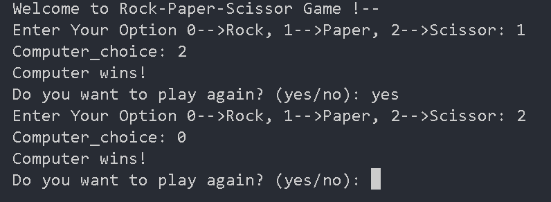

# 🗺️ Treasure Map - Day 4 of #100DaysOfPython

A simple Python program that creates a treasure map on a 3x3 grid where users can mark their treasure spot with an "X".

## Features
- **Interactive 3x3 grid** representation
- **Input validation** for row/column selection
- **Visual treasure placement** with "X" marker
- **Beginner-friendly** list manipulation

## 🚀 How It Works
1. Program displays a blank 3x3 grid
2. User selects row (1-3) and column (1-3)
3. Program marks the spot with "X" to hide the treasure!

## 💻 Code Example
[Treasure Map Program Screenshot](images/Treasure_map.png)

# 🪨 📄 ✂️ Rock Paper Scissors - Day 4 of #100DaysOfPython



A classic Rock Paper Scissors game implemented in Python with simple AI opponent.

## Features
- **Player vs Computer** gameplay
- **Randomized AI** choices
- **Score tracking** (Wins/Losses/Ties)
- **Input validation**
- **ASCII art** for visual feedback

## 🎮 How to Play
1. Run the script:
   ```bash
   python rock_paper_scissors.py
